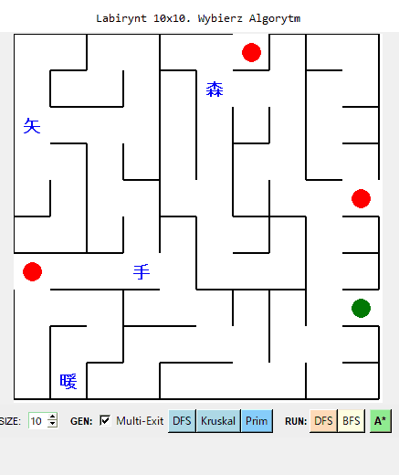

# DSA Maze pathfinding
This is a mini-project for data structures and algorithms course in my uni.
It implements three algorithms for generating maze (DFS , Kruskal , Prim) and three for pathfinding (DFS , BFS , A* with Manhattan heuristic).
Allows to include multi-exit scenario and also containes 4 other targets other than exits that algorithm has to pick up first in order to find an exit.
Also the path is demonstrated by simple Tkinter animation and statistics for each algorithm to highlight overall performance.

  

